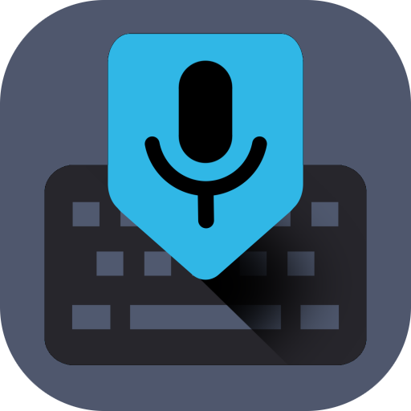
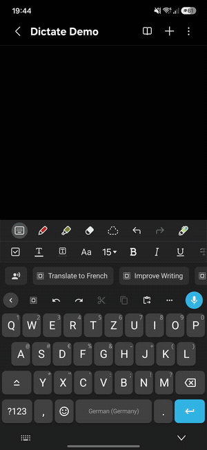

# Dictate Keyboard

### Speak instead of type — in any app.

A powerful Whisper AI keyboard for dictation, real-time transcription and typing.

  
  
  
  
  
  

  
  

<table align="center">
  <tr>
    <td valign="middle"></td>
    <td valign="middle"></td>
  </tr>
</table>

---

> **Note:** This is a complete rebuild of Dictate as a full, standalone keyboard on top of
> [**FlorisBoard**](https://github.com/florisboard/florisboard), replacing the original Java
> app that powered Dictate v1–v3. The previous Java codebase is preserved on the
> [`legacy-java`](https://github.com/DevEmperor/Dictate/tree/legacy-java) branch.

---

## 🎬 See it in action

<table>
  <tr>
    <td width="330" align="center">
      
    </td>
    <td valign="middle">
      <h3>Speak, and it's typed.</h3>
      Tap the mic, talk naturally, and watch clean, punctuated text land in <b>any</b> app —
      in real time. Prefer keys? Glide-type with word suggestions and autocorrect. Need it
      more formal, translated or summarised? Hand it to an AI rewording prompt.
    </td>
  </tr>
</table>

 

## 📸 Screenshots

<table>
  <tr>
    <td></td>
    <td></td>
    <td></td>
    <td></td>
  </tr>
  <tr>
    <td></td>
    <td></td>
    <td></td>
    <td></td>
  </tr>
</table>

 

## 📲 Installation

**The app is available on [Google Play](https://play.google.com/store/apps/details?id=net.devemperor.dictate)**
(for a small fee that supports continued development), giving you easy installation and free
lifetime updates. Just tap the badge above or [this link](https://play.google.com/store/apps/details?id=net.devemperor.dictate).

> **Existing users:** the new keyboard keeps the same app identity and signing key, so your
> settings carry over on update — no reinstall, no lost configuration.

 

## ✨ What is Dictate?

**Dictate** is an easy-to-use keyboard for transcribing and dictating. It uses
[OpenAI Whisper](https://openai.com/index/whisper/) in the background, which delivers
extremely accurate results for
[many different languages](https://platform.openai.com/docs/guides/speech-to-text/supported-languages),
complete with punctuation — plus custom AI rewording powered by leading models from OpenAI,
Google Gemini and many other providers.

Instead of pecking at keys, just tap the microphone, speak, and watch your words appear —
now in real time — as clean, formatted text in any app. Prefer to type? Dictate is a
complete keyboard too, with glide typing, word suggestions and autocorrect. Need the text
more formal, translated, summarised, or fixed-up? Hand it to a rewording prompt and let the
model do the work. With the floating button you can even dictate straight into apps while
another keyboard is open.

 

## 🎤 Features

- **Voice dictation with Whisper AI** — highly accurate speech-to-text in dozens of languages, with automatic punctuation. It's so sensitive you can literally *whisper* and still get a clean transcription.
- **Real-time transcription** — watch your words appear live as you speak, streaming from OpenAI, Deepgram, Soniox, AssemblyAI or ElevenLabs.
- **On-device transcription** — dictate completely offline with a downloadable on-device model (Whisper, NVIDIA Parakeet or a German-specialised Parakeet): no internet needed and nothing ever leaves your phone. Models keep downloading in the background even if you leave the app.
- **Transcription history** — every dictation is saved to a searchable history you can re-insert, replay, re-transcribe or pin, with full control over how long audio is kept.
- **Long-form dictation** — speak for as long as you like: long recordings are transcribed in the background in segments, so you get your text sooner and never hit a length limit.
- **Glide typing, suggestions & autocorrect** — Dictate is now a complete typing keyboard too: swipe across the keys to type whole words, with per-language dictionaries, word suggestions, spell check and autocorrect.
- **Classic keyboard-free dictation layout** — bring back the pure, voice-first screen from Dictate 3: lock it in, or keep it just a swipe away from the full keyboard — now with a fully customizable action row (drag & drop), an Enter-key symbol popup and long-form controls.
- **Wear OS keyboard** — dictate straight from your watch, tethered through your phone or fully standalone.
- **Floating dictation button** — dictate straight into **any** app, even when another keyboard is active. Pick from three styles (Pill, Ring, Orb), watch a live waveform while you speak, drag it anywhere with edge-snapping, set its color and size, and long-press to reword.
- **AI rewording & rewriting** — turn a selection into something more formal, casual, translated, summarised, or anything you define with custom prompts, with adjustable reasoning effort.
- **Community prompt library** — browse rewording prompts shared by others and install them in a tap, or publish your own.
- **Dictation statistics** — track how much you've dictated and typed, with milestones and a home-screen overview.
- **Find & replace rules** — automatically fix recurring words, names or phrases in every transcript.
- **Single-call multimodal mode** — let one audio-capable AI model transcribe *and* format in a single request, for lower latency and cost.
- **Custom prompts & snippets** — build your own reword actions; reusable text snippets are inserted instantly without an API call.
- **GIF search** — search and insert GIFs right from the keyboard, powered by [KLIPY](https://klipy.com). Add your own free KLIPY API key (bring-your-own-key, like the AI providers); search terms are only sent while the GIF panel is open.
- **Searchable settings** — find any option by name and jump straight to it, no digging through menus.
- **Bring your own key & provider** — use your own API key with OpenAI, Google Gemini, Groq, Mistral, OpenRouter, Anthropic, Soniox, Deepgram, AssemblyAI, ElevenLabs and other compatible endpoints, so you stay in control of usage and cost.
- **A real, full keyboard** *(courtesy of the FlorisBoard base):*
  - Huge variety of keyboard layouts and easy language/subtype switching
  - Full theme customization with day/night presets, automatic switching and a high-contrast E-Reader theme
  - Emoji keyboard, clipboard manager & cursor tools
  - One-handed / compact mode, gesture actions, customizable key sound & haptic feedback
- **Privacy-respecting by design** — no tracking; your audio goes only to the AI provider you configure.

<i>Bring your own API key — Dictate works with:</i>

  
  
  
  
  
  
  
  
  
  
  
  

 

## 🧱 Built on FlorisBoard

Dictate Keyboard is a fork of [**FlorisBoard**](https://github.com/florisboard/florisboard),
an open-source, privacy-respecting keyboard created by
[Patrick Goldinger](https://github.com/patrickgold) and
[The FlorisBoard Contributors](https://github.com/florisboard/florisboard/graphs/contributors).
Their work provides the entire keyboard foundation — layouts, theming, gesture handling,
clipboard tools and the IME plumbing — on top of which Dictate adds its voice-dictation and
AI-rewording layer.

Huge thanks to the FlorisBoard team. FlorisBoard is licensed under the Apache License 2.0;
see [`LICENSE`](LICENSE) and [`NOTICE`](NOTICE) for full attribution.

 

## 🤝 Contributing

The best way to help right now is to **[open an issue](https://github.com/DevEmperor/DictateKeyboard/issues)**
with bug reports, ideas or feedback. Full contribution and community guidelines will be
published as the project matures. Thank you! 🙏

 

## 📄 License & attribution

Dictate Keyboard is released under the terms of the
[Apache License 2.0](https://www.apache.org/licenses/LICENSE-2.0).

- This project is a fork of **FlorisBoard** — Copyright © The FlorisBoard Contributors,
  licensed under Apache-2.0.
- See [`LICENSE`](LICENSE) for the full license text and [`NOTICE`](NOTICE) for required
  attribution notices.
- Speech recognition is powered by [OpenAI Whisper](https://openai.com/index/whisper/).
- GIF search is powered by [KLIPY](https://klipy.com); GIFs are served by KLIPY under their terms.

 

## ❤️ Support &amp; sponsors

Dictate is free and open source, built in my spare time. If it makes your day a little
easier, you can support development by
[buying the app on Google Play](https://play.google.com/store/apps/details?id=net.devemperor.dictate),
[sponsoring me on GitHub](https://github.com/sponsors/DevEmperor),
or [donating via PayPal](https://paypal.me/DevEmperor). Every bit helps — thank you! 🙏

**Dictate's sponsors — thank you!** 🎉

<!-- SPONSORS:START -->

  
  

<!-- SPONSORS:END -->
