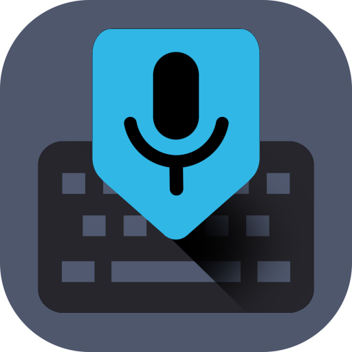
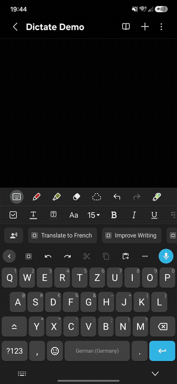

# Dictate Keyboard

### Speak instead of type — in any app.

A powerful Whisper AI keyboard for dictation, real-time transcription and typing.

  
  
  
  
  
  
  

  
  

<table align="center">
  <tr>
    <td valign="middle"></td>
    <td valign="middle"></td>
  </tr>
</table>

---

> **Note:** This is a complete rebuild of Dictate as a full, standalone keyboard on top of
> [**FlorisBoard**](https://github.com/florisboard/florisboard), replacing the original Java
> app that powered Dictate v1–v3. The previous Java codebase is preserved on the
> [`legacy-java`](https://github.com/DevEmperor/Dictate/tree/legacy-java) branch.

---

## 🎬 See it in action

<table>
  <tr>
    <td width="330" align="center">
      
    </td>
    <td valign="middle">
      <h3>Speak, and it's typed.</h3>
      Tap the mic, talk naturally, and watch clean, punctuated text land in <b>any</b> app —
      in real time. Prefer keys? Glide-type with word suggestions and autocorrect. Need it
      more formal, translated or summarised? Hand it to an AI rewording prompt.
    </td>
  </tr>
</table>

 

## 📸 Screenshots

<table>
  <tr>
    <td></td>
    <td></td>
    <td></td>
    <td></td>
  </tr>
  <tr>
    <td></td>
    <td></td>
    <td></td>
    <td></td>
  </tr>
</table>

 

## 📲 Installation

**The app is available on [Google Play](https://play.google.com/store/apps/details?id=net.devemperor.dictate&referrer=utm_source%3Dgithub%26utm_medium%3Dintro%26utm_campaign%3Dreadme)**
(for a small fee that supports continued development), giving you easy installation and free
lifetime updates. Just tap the badge above or [this link](https://play.google.com/store/apps/details?id=net.devemperor.dictate&referrer=utm_source%3Dgithub%26utm_medium%3Dintro_link%26utm_campaign%3Dreadme).

> **Existing users:** the new keyboard keeps the same app identity and signing key, so your
> settings carry over on update — no reinstall, no lost configuration.

 

## ✨ What is Dictate?

**Dictate** is an easy-to-use keyboard for transcribing and dictating. It uses
[OpenAI Whisper](https://openai.com/index/whisper/) in the background, which delivers
extremely accurate results for
[many different languages](https://platform.openai.com/docs/guides/speech-to-text/supported-languages),
complete with punctuation — plus custom AI rewording powered by leading models from OpenAI,
Google Gemini and many other providers.

Instead of pecking at keys, just tap the microphone — or hold it like a voice message and
let go to send — and watch your words appear in real time as clean, formatted text in any
app, online or entirely offline. Prefer to type? Dictate is a complete keyboard too, with
glide typing, next-word prediction and an autocorrect that reads your fingers rather than
your typos. Need the text more formal, translated, summarised, or fixed-up? Hand it to a
rewording prompt and let the model do the work. With the floating button you can even
dictate straight into apps while another keyboard is open.

There are four ways to power it, and you pick one during setup: **your own API key** with the
provider of your choice, **a server of your own**, **a model on the device** with no network at
all, or **prepaid credit** if you would rather not deal with any of that. The first three cost
Dictate nothing and are not going anywhere.

 

## 🎤 Features

- **Voice dictation with Whisper AI** — highly accurate speech-to-text in over a hundred languages, with automatic punctuation. It's so sensitive you can literally *whisper* and still get a clean transcription.
- **Push to talk** — hold the mic key and speak, let go and it's sent, like a voice message. Slide left to throw the recording away, drag up to lock it hands-free. A quick tap still works the way it always did.
- **Use Dictate from any keyboard** — Dictate registers as a system-wide voice input, so the mic key in other keyboards and apps can transcribe through Dictate, with your provider, prompts and on-device models. No accessibility permission needed, so it also works in apps that block it.
- **Real-time transcription** — watch your words appear live as you speak, streaming from OpenAI, Google Gemini, Deepgram, Soniox, AssemblyAI or ElevenLabs. Deepgram's **Flux** models decide for themselves when a turn has ended instead of waiting out a silence timer.
- **On-device transcription — now live, too** — dictate completely offline with a downloadable model: no internet needed and nothing ever leaves your phone. Streaming models write as you speak in ten languages, and for one-shot accuracy there is Whisper, NVIDIA Parakeet (25 European languages), Canary (English, German, French and Spanish in a third of the space) and models specialised in German or Russian. Hold the send button to run just one dictation locally without switching providers, and models free their memory again when idle. Models keep downloading in the background even if you leave the app.
- **Share a voice message and read it** — Dictate is in the share sheet for audio and video, so a voice message from any app can be handed straight to it. A screen opens and starts transcribing by itself; the result is searchable, and long files are handled in pieces rather than turned away.
- **Transcription history** — every dictation is saved to a searchable history you can re-insert, replay, re-transcribe or pin, with full control over how long audio is kept.
- **Long-form dictation** — speak for as long as you like: long recordings are transcribed in the background in segments, so you get your text sooner and never hit a length limit. An optional on-device Smart Turn model cuts at finished thoughts instead of at every pause.
- **Glide typing, suggestions & autocorrect** — Dictate is a complete typing keyboard too: swipe across the keys to type whole words, with dictionaries for over forty languages — Arabic, Bengali, Finnish, Hindi, Indonesian, Tamil and Urdu among them — spell check and an autocorrect that decides from where your fingers actually landed rather than from the finished word. How eagerly it corrects is yours to set, the word the space bar is about to take is marked in your accent colour, and backspace right after a correction gives back exactly what you typed. It offers the next word before you type it, and any word can be added to your dictionary with a long press.
- **Classic keyboard-free dictation layout** — bring back the pure, voice-first screen from Dictate 3: lock it in, or keep it just a swipe away from the full keyboard — now with a fully customizable action row (drag & drop), an Enter-key symbol popup and long-form controls.
- **Wear OS keyboard** — dictate straight from your watch, tethered through your phone or fully standalone.
- **Floating dictation button** — dictate straight into **any** app, even when another keyboard is active. Pick from six styles (Pill, Ring, Orb, the audio-reactive Cloud and the new Aurora and Lattice orbs), watch a live waveform while you speak, drag it anywhere with edge-snapping, set its color and size, and long-press for rewording — or for a **freeform voice command**: just say what you want and the AI does it, using any selected text as context.
- **AI rewording & rewriting** — turn a selection into something more formal, casual, translated, summarised, or anything you define with custom prompts, with adjustable reasoning effort.
- **Community prompt library** — browse rewording prompts shared by others and install them in a tap, or publish your own.
- **Dictation statistics** — track how much you've dictated and typed, with milestones and a home-screen overview.
- **Cleaner transcripts, cheaper uploads** — long silences are trimmed out of a recording before it is sent, and it can be sped up without your voice going higher: providers bill by audio length, so a recording a third shorter costs a third less. Long dictations are packed rather than refused, and can be split into paragraphs automatically at sentence boundaries.
- **Contact names, without the address book** — put your contacts' names into the personal dictionary so the keyboard stops underlining them and starts suggesting them. Dictate never asks for contacts permission: you pick the names through a picker, or import a vCard. Nothing is read that you did not hand over.
- **Find & replace rules** — automatically fix recurring words, names or phrases in every transcript.
- **Single-call multimodal mode** — let one audio-capable AI model transcribe *and* format in a single request, for lower latency and cost.
- **Custom prompts & snippets** — build your own reword actions; reusable text snippets (a prompt written in `[square brackets]`) are inserted instantly without an API call. Give a snippet a typing shortcut and it expands as you type: `r5` plus a space becomes the whole block, and one backspace puts the shortcut back.
- **GIF search** — search and insert GIFs right from the keyboard, powered by [KLIPY](https://klipy.com). Add your own free KLIPY API key (bring-your-own-key, like the AI providers); search terms are only sent while the GIF panel is open.
- **Your own stickers** — point the keyboard at a folder of your own images and insert them straight into a chat. Subfolders become tabs, long-press pins a favourite or deletes the file, and nothing leaves the device. Share a sticker to Dictate from WhatsApp, Telegram or anywhere else and it lands in the folder.
- **Searchable settings** — find any option by name and jump straight to it, no digging through menus.
- **Dictate Cloud — credit instead of an API key** *(optional)* — buy prepaid minutes through Google Play and skip the provider sign-up entirely. Neither your recordings nor your text are stored on the way through; the server that does it lives in [`cloud/`](cloud/) in this repository, so the privacy claims can be read rather than believed. No name, no email address — just a wallet and a recovery code you can delete from inside the app.
- **Bring your own key & provider** — use your own API key with OpenAI, Google Gemini, Groq, Mistral, OpenRouter, Anthropic, Soniox, Deepgram, AssemblyAI, ElevenLabs and other compatible endpoints, so you stay in control of usage and cost. Gemini transcribes with Google's dedicated speech-to-text models rather than a chat model under instruction, and if you speak more than one language you can say which ones instead of picking one and hoping.
- **Self-hosting friendly** — point Dictate at a server of your own for transcription, rewording and even live streaming, and let it wake a sleeping GPU machine before the first request arrives.
- **A real, full keyboard** *(courtesy of the FlorisBoard base):*
  - Huge variety of keyboard layouts and easy language/subtype switching, including **phonetic Russian** (ЯШЕРТЫ) beside ЙЦУКЕН
  - **French finds its accents from the plain letters** — `ho` reaches *hôte* and *hôtel*, and an unaccented spelling still gets its accent back
  - **Chinese input** with Pinyin and a candidate row, alongside the Zhengma shape-based method
  - Full theme customization with day/night presets, automatic switching and a high-contrast E-Reader theme
  - Emoji keyboard with search in **51 languages** — look for "heart", "心" or "قلب" and land on the same emoji — plus clipboard manager & cursor tools
  - One-handed / compact mode, gesture actions, customizable key sound & haptic feedback
- **Privacy-respecting by design** — no tracking, and your audio goes only to the provider you configure. Choose a key, a server of your own or an on-device model and Dictate never talks to us at all; choose Dictate Cloud and nothing you say or write is stored on the way through.

<i>Bring your own API key — Dictate works with:</i>

  
  
  
  
  
  
  
  
  
  
  
  

 

## 🖥️ Using your own server

Dictate speaks the plain OpenAI API, so any server that does too can handle your dictation —
[Speaches](https://github.com/speaches-ai/speaches), faster-whisper-server, `whisper.cpp`'s server,
vLLM, or something you wrote yourself. Nothing is hardcoded about it:

1. **Settings → AI providers → Add your own server**
2. **Base URL** — the address of your server *including the trailing `/v1/`*, e.g.
   `http://192.168.1.20:8000/v1/`. Dictate appends `audio/transcriptions` and `chat/completions`
   to it. Plain `http://` on your own network is fine.
3. **API key** — leave it empty if your server does not ask for one. No `Authorization` header is
   sent then.
4. **Transcription model** — browse your server's `/v1/models`, or just type the model id by hand.
   Servers that expose no catalog, or a non-standard one, work fine that way.
5. Pick it as the active provider for transcription, rewording, or both.

Two things worth knowing: **`localhost` means the phone, not the machine your server runs on** —
use its address on your network. And if your server also speaks the OpenAI *realtime* protocol
under `/v1/realtime`, switch on **Realtime** in the same editor to dictate live.

**Ollama is a special case.** It serves no `/v1/audio/transcriptions`, so it can only reword. Run a
speech server next to it for dictation — or use the on-device engine below and skip servers
entirely.

**No server at all:** Dictate can also transcribe **fully on your device** with a downloadable
model (Whisper, Parakeet, Canary, GigaAM, SenseVoice, or a live-typing Kroko model). No account, no
network, no audio leaving the phone — offered right in the setup wizard, and under
*Settings → AI providers → On-device (offline)*.

 

## ☁️ Dictate Cloud

Everything above needs you to bring *something* — a key, a server, or the patience to download a
model. **Dictate Cloud** is for the people who would rather not: buy prepaid minutes through Google
Play and start dictating. It is one option among four, it is off unless you choose it, and the rest
of the app does not depend on it in any way.

Because it is the one path where your words pass through a machine of ours, here is exactly what
that machine does:

- **Nothing of yours is written to disk.** Your audio and your text are forwarded to the provider
  and the answer comes straight back. What is stored is numbers — wallet id, timestamp, duration,
  token counts, status code, milliseconds.
- **It has no idea who you are.** An account is a wallet and a recovery code; no name, no email
  address, no sign-in. You can delete it from inside the app, and the app says what deletion leaves
  behind before you do.
- **The source is right here**, in [`cloud/`](cloud/) — a single Cloudflare Worker. The privacy
  policy makes claims about this server, and [`cloud/src/meter.ts`](cloud/src/meter.ts) is the only
  file in it that writes anything. That is the point of publishing it: a claim you can read the
  source of is worth more than one you have to take on trust.
- **Credit is seconds**, and every service prices itself into them. So a pack's price is a hard
  ceiling on what it can cost to serve, whatever you spend it on — which is why there is no fair-use
  clause anywhere.

Larger packs cost less per minute, and the shop says by how much. If you already have an API key,
keep using it — it is the cheaper way and it is not going to stop working.

 

## 🧱 Built on FlorisBoard

Dictate Keyboard is a fork of [**FlorisBoard**](https://github.com/florisboard/florisboard),
an open-source, privacy-respecting keyboard created by
[Patrick Goldinger](https://github.com/patrickgold) and
[The FlorisBoard Contributors](https://github.com/florisboard/florisboard/graphs/contributors).
Their work provides the entire keyboard foundation — layouts, theming, gesture handling,
clipboard tools and the IME plumbing — on top of which Dictate adds its voice-dictation and
AI-rewording layer.

Huge thanks to the FlorisBoard team. FlorisBoard is licensed under the Apache License 2.0;
see [`LICENSE`](LICENSE) and [`NOTICE`](NOTICE) for full attribution.

 

## 🤝 Contributing

The best way to help right now is to **[open an issue](https://github.com/DevEmperor/DictateKeyboard/issues)**
with bug reports, ideas or feedback. Full contribution and community guidelines will be
published as the project matures. Thank you! 🙏

**Found a security problem?** Please don't open a public issue for it — use
[GitHub's private advisory form](https://github.com/DevEmperor/DictateKeyboard/security/advisories/new).
[`SECURITY.md`](SECURITY.md) says what is in scope, what isn't, and what to expect.

 

## 📄 License & attribution

Dictate Keyboard is released under the terms of the
[Apache License 2.0](https://www.apache.org/licenses/LICENSE-2.0).

- This project is a fork of **FlorisBoard** — Copyright © The FlorisBoard Contributors,
  licensed under Apache-2.0.
- See [`LICENSE`](LICENSE) for the full license text and [`NOTICE`](NOTICE) for required
  attribution notices.
- Speech recognition is powered by [OpenAI Whisper](https://openai.com/index/whisper/).
- On-device transcription uses [OpenAI Whisper](https://openai.com/index/whisper/) (MIT),
  NVIDIA's [Parakeet](https://huggingface.co/nvidia/parakeet-tdt-0.6b-v3) and
  [Canary](https://huggingface.co/nvidia/canary-180m-flash) models and the primeline German
  fine-tune (CC-BY-4.0), [GigaAM](https://github.com/salute-developers/GigaAM) for Russian (MIT),
  and — for live transcription — the [Kroko ASR](https://huggingface.co/Banafo/Kroko-ASR)
  community models by Banafo (CC-BY-SA). All of them are exported to ONNX by
  [sherpa-onnx](https://github.com/k2-fsa/sherpa-onnx).
- The Lattice button design is ported from
  [thinking-orbs](https://github.com/Jakubantalik/thinking-orbs) by Jakub Antalik (MIT).
- GIF search is powered by [KLIPY](https://klipy.com); GIFs are served by KLIPY under their terms.

 

## ❤️ Support &amp; sponsors

Dictate is free and open source, built in my spare time. If it makes your day a little
easier, you can support development by
[buying the app on Google Play](https://play.google.com/store/apps/details?id=net.devemperor.dictate&referrer=utm_source%3Dgithub%26utm_medium%3Dsupport%26utm_campaign%3Dreadme),
[sponsoring me on GitHub](https://github.com/sponsors/DevEmperor),
or [donating via PayPal](https://paypal.me/DevEmperor). Every bit helps — thank you! 🙏

**Dictate's sponsors — thank you!** 🎉

<!-- SPONSORS:START -->

  
  
  

<!-- SPONSORS:END -->
